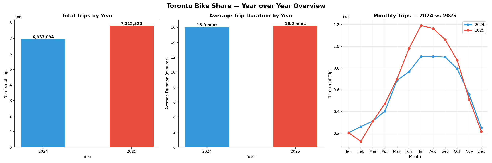
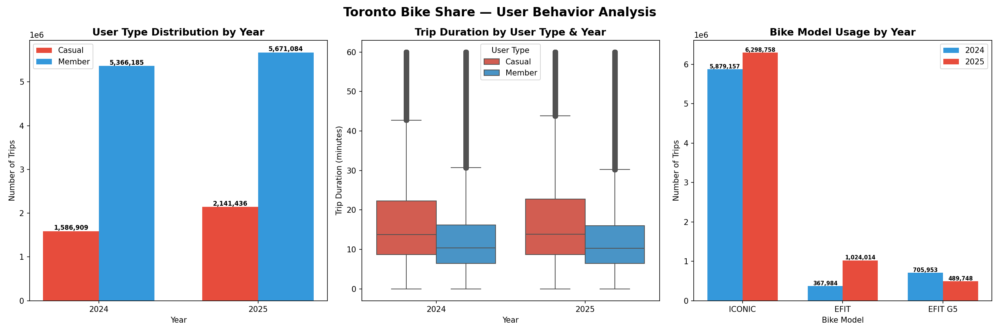
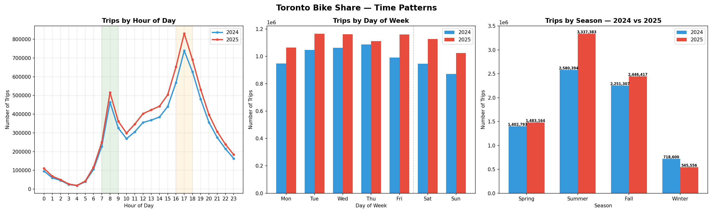
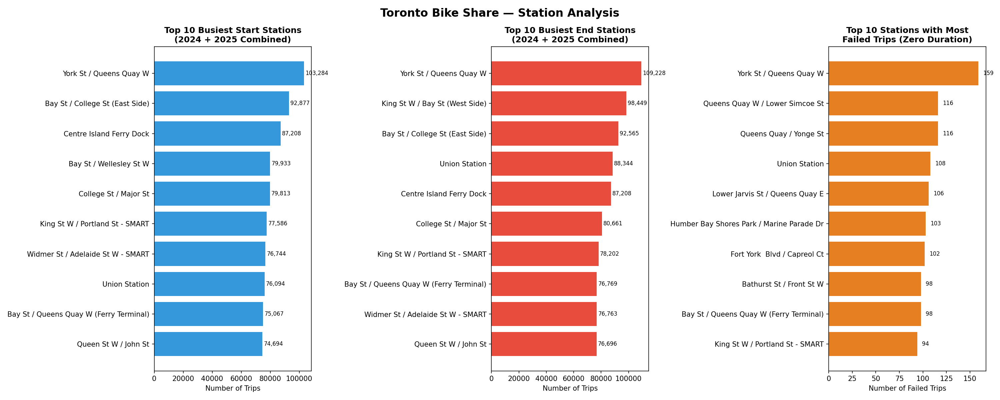
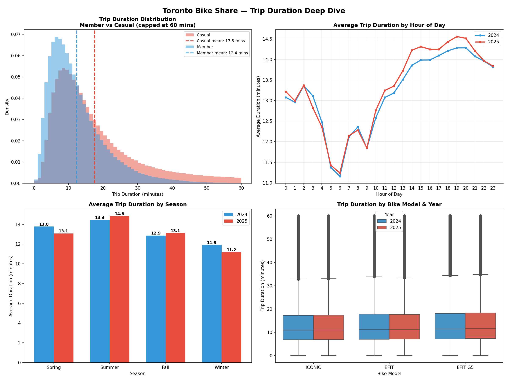
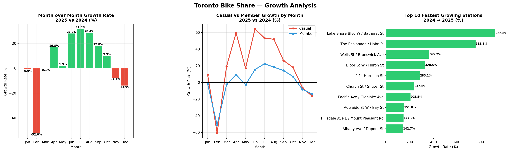
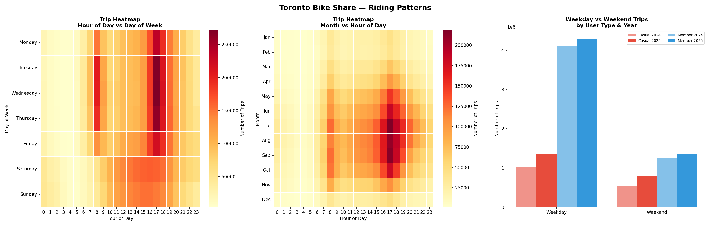
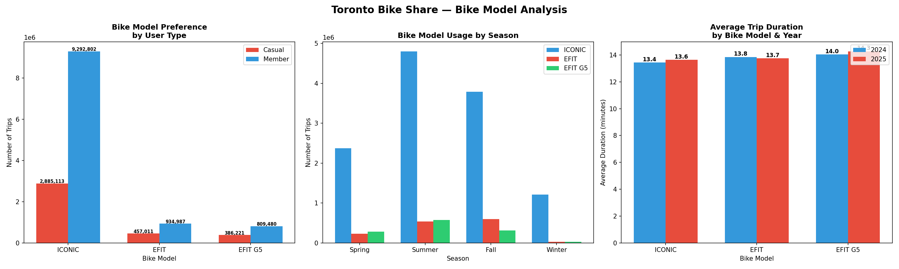
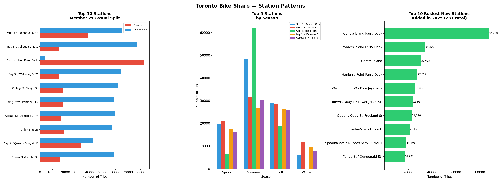

# 🚲 Toronto Bike Share — Exploratory Data Analysis

A comprehensive exploratory data analysis project using Python, pandas, matplotlib, and seaborn on **14.7 million Toronto Bike Share trips** spanning two full years — 2024 and 2025. This is the largest dataset analyzed in this portfolio, requiring memory optimization, encoding detection, and careful multi-year data engineering before analysis could begin.

> 📍 Data source: City of Toronto Open Data Portal

---

## 📁 Project Structure

```
toronto_bikeshare/
│
├── data_source/
│   ├── bikeshare-ridership-2024.csv              # 2024 full year (single file)
│   └── bikeshare-ridership-2025/
│       ├── bikeshare_2025_01.csv                 # monthly files
│       ├── bikeshare_2025_02.csv
│       └── ... (12 files)
│
├── visualizations/
│   ├── year_over_year.png                        # Section 1 — YoY overview
│   ├── user_behavior.png                         # Section 2 — user behavior
│   ├── time_patterns.png                         # Section 3 — time patterns
│   ├── station_analysis.png                      # Section 4 — station analysis
│   ├── trip_duration_analysis.png                # Section 5 — trip duration
│   ├── growth_analysis.png                       # Section 6 — growth analysis
│   ├── riding_patterns.png                       # Section 7 — riding patterns
│   ├── bike_model_analysis.png                   # Section 8 — bike model
│   ├── station_patterns.png                      # Section 9 — station patterns
│   └── summary_dashboard.png                     # Section 10 — summary
│
└── bikeshare.ipynb                               # EDA notebook
```

---

## 📊 Dataset Overview

| Property | Detail |
|---|---|
| Total Rows | 14,765,614 trips |
| Years | 2024 (6,953,094) and 2025 (7,812,520) |
| Columns | 11 original + 5 engineered |
| Memory (raw) | ~1.3 GB |
| Memory (optimized) | ~591 MB |
| File encoding | 2025: Windows-1252 (cp1252) \| 2024: ASCII |
| Missing Values | 15,185 End_Station_Id \| 6,914 End_Time |
| Duplicates | None |

### Columns

| Column | Type | Description |
|---|---|---|
| `Trip_Id` | int32 | Unique trip identifier |
| `Trip_Duration` | int32 | Trip duration in seconds |
| `Start_Station_Id` | float32 | Starting station ID |
| `Start_Time` | datetime64 | Trip start timestamp |
| `Start_Station_Name` | category | Starting station name |
| `End_Station_Id` | float32 | Ending station ID |
| `End_Time` | datetime64 | Trip end timestamp |
| `End_Station_Name` | category | Ending station name |
| `Bike_Id` | int16 | Bike identifier |
| `User_Type` | category | Casual or Member |
| `Bike_Model` | category | ICONIC, EFIT, or EFIT G5 |
| `Year` | int16 | 2024 or 2025 (engineered) |
| `month` | int8 | Month number (engineered) |
| `hour` | int8 | Hour of day (engineered) |
| `day_of_week` | category | Day name (engineered) |
| `season` | category | Spring/Summer/Fall/Winter (engineered) |

---

## 🔧 Data Engineering

### Memory Optimization
Reduced memory from **1.3 GB → 591 MB** (54% reduction) by:
- Converting object columns to `category` dtype — biggest win for station names repeated millions of times
- Downcasting integers from `int64` → `int32` / `int16`
- Downcasting floats from `float64` → `float32`
- Converting date strings to `datetime64`

### Encoding Detection
```python
import chardet
# 2025 files: Windows-1252 (cp1252) — confidence 73%
# 2024 file: ASCII — confidence 100%
```

### Data Quality Findings

| Issue | Count | Decision |
|---|---|---|
| Zero-duration failed trips | 16,352 | Retained in `df_all`, filtered via `df_trips` |
| Trips over 24 hours | 879 | Retained — likely lost/abandoned bikes |
| End_Station_Id nulls | 15,185 | Retained — documented pattern |
| End_Time nulls | 6,914 | Retained |

**Null pattern finding:** Both years show the same split — zero-duration trips with null End_Station_Id (failed dock/undock events) alongside real trips with missing end station data. This is a **systemic logging issue** confirmed across both years.

| Year | Zero-duration nulls | Real trips missing end station |
|---|---|---|
| 2024 | 5,044 | 3,380 |
| 2025 | 2,986 | 3,775 |

---

## 🔍 Key Findings at a Glance

| Metric | 2024 | 2025 | Change |
|---|---|---|---|
| Total trips | 6,953,094 | 7,812,520 | +12.4% |
| Member trips | 5,366,185 | 5,671,084 | +5.7% |
| Casual trips | 1,586,909 | 2,141,436 | +34.9% |
| Avg trip duration | 16.0 mins | 16.2 mins | +1.3% |
| Peak month | July | July | — |
| Peak hour | 5pm | 5pm | — |
| ICONIC trips | 5,879,157 | 6,298,758 | +7.1% |
| EFIT trips | 367,984 | 1,024,014 | +178.3% |
| EFIT G5 trips | 705,953 | 489,748 | -30.6% |
| New stations | — | 237 | — |

---

## 📈 Analysis & Insights

### Section 1 — Year over Year Overview
- Ridership grew **12.4%** from 2024 to 2025 — adding 859,426 trips
- Average trip duration remained stable at ~16 minutes despite the growth
- Both years follow the same seasonal curve — low in winter, peaking in July
- **February 2025 dipped sharply** — visible anomaly in the monthly line chart



---

### Section 2 — User Behavior
- Members dominate — 77% of all trips across both years
- **Casual riders are the primary growth driver** — +34.9% vs only +5.7% for members
- Casual riders take longer trips (~15 min median) vs members (~10 min median)
- EFIT e-bikes grew 178% — fastest growing model in the fleet
- EFIT G5 declined 30.6% — being phased out and replaced by EFIT



---

### Section 3 — Time Patterns
- Classic **bimodal commuter pattern** — peaks at 8am and 5pm on weekdays
- Thursday 5pm is the single busiest hour-day combination
- Weekdays busier than weekends — Wednesday and Thursday peak
- **Summer 2025 added 757,000 more trips** than Summer 2024 — biggest seasonal jump
- Winter 2025 actually had fewer trips than Winter 2024 — harsher weather conditions



---

### Section 4 — Station Analysis
- **York St / Queens Quay W** — busiest start (103,284) and end (109,228) station
- Mix of commuter hubs (Union Station, Bay St) and recreational spots (Centre Island)
- Union Station attracts more ending trips than starting — people bike TO the train
- Failed trips are rare (94–159 per top station) and concentrated in the waterfront corridor



---

### Section 5 — Trip Duration Deep Dive
- Casual riders average ~18 mins vs members ~12 mins — consistent across both years
- Trip duration peaks at **midday (12–2pm)** — leisure rides are longer
- Summer trips are longer than winter trips across all user types
- All three bike models have nearly identical trip durations (13.4–14.0 mins)



---

### Section 6 — Growth Analysis
- **February 2025 crashed -52%** — the most dramatic single-month drop
- Casual riders drove the February crash — down ~60% vs members down ~50%
- Peak growth months: July (+31.5%) and June (+28.4%)
- **Lake Shore Blvd W / Bathurst St grew 922.8%** — new station opened in 2025
- November and December both declined year over year



---

### Section 7 — Riding Patterns
- **Two heatmaps tell the complete story** — commuter pattern on weekdays, recreational on weekends
- July evenings are 5x busier than January mornings
- Casual riders nearly double on weekends — members stay relatively flat
- Weekend to weekday ratio is much closer for casual riders than members



---

### Section 8 — Bike Model Analysis
- ICONIC dominates every season, user type, and year
- **Centre Island Ferry Dock** is the only top-10 station primarily used by casual riders
- E-bikes attract proportionally more casual riders than regular bikes
- EFIT G5 nearly disappears in Winter — the most weather-sensitive model



---

### Section 9 — Station Patterns
- **237 new stations added in 2025** — massive network expansion
- Top new stations are all Toronto Islands destinations — Ward's Island, Centre Island, Hanlan's Point
- Centre Island Ferry Dock alone generated **87,208 trips** as a new station
- The island expansion explains much of the casual rider growth in 2025
- Commuter stations (Union Station, Bay St) are consistent year-round
- Recreational stations (Centre Island) spike dramatically in Summer and collapse in Winter



---

## 🧠 Key Business Insights

1. **Casual riders are the growth story** — growing 34.9% vs 5.7% for members, driven by 237 new stations and Toronto Islands expansion

2. **The February 2025 anomaly** — a -52% crash in a single month driven almost entirely by casual riders, confirming their extreme weather sensitivity vs habitual member commuters

3. **Toronto Bike Share is a tale of two systems** — a weekday commuter network for members (peaking Thursday 5pm) that transforms into a recreational platform on summer weekends for casual riders

4. **The EFIT transition** — EFIT usage grew 178% while EFIT G5 declined 30.6%, confirming a clear fleet modernization strategy in progress

5. **Island expansion changed the network** — adding Toronto Islands stations in 2025 brought in a new category of recreational user that didn't exist in 2024

6. **York St / Queens Quay W is the undisputed hub** — busiest start station, busiest end station, and most failed trips across both years

7. **Trip duration is remarkably stable** — despite 12.4% more trips, 237 new stations, and a new e-bike model, average trip duration barely moved (16.0 → 16.2 mins)

---

## 🛠️ Tools Used

- Python 3.8
- pandas
- NumPy
- matplotlib
- seaborn
- chardet (encoding detection)
- glob (multi-file loading)
- Jupyter Notebook

---

## 🚀 How to Run

1. Clone the repository
2. Install dependencies
```bash
pip install pandas numpy matplotlib seaborn chardet jupyter
```
3. Open the notebook
```bash
jupyter notebook bikeshare.ipynb
```

---

## 📂 Dataset

- **Source:** [City of Toronto Open Data Portal — Bike Share Toronto Ridership](https://open.toronto.ca/dataset/bike-share-toronto-ridership-data/)
- **Records:** 14,765,614 trips across 2024 and 2025
- **Type:** Real open government data

---

## 👤 Author

**NIO**
Sixth exploratory data analysis portfolio project — largest dataset analyzed to date at 14.7 million rows, featuring multi-file loading, encoding detection, memory optimization, and two-year comparative analysis
